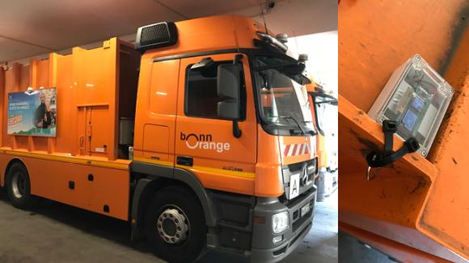
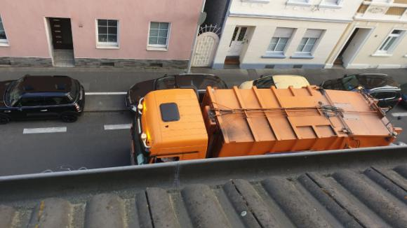
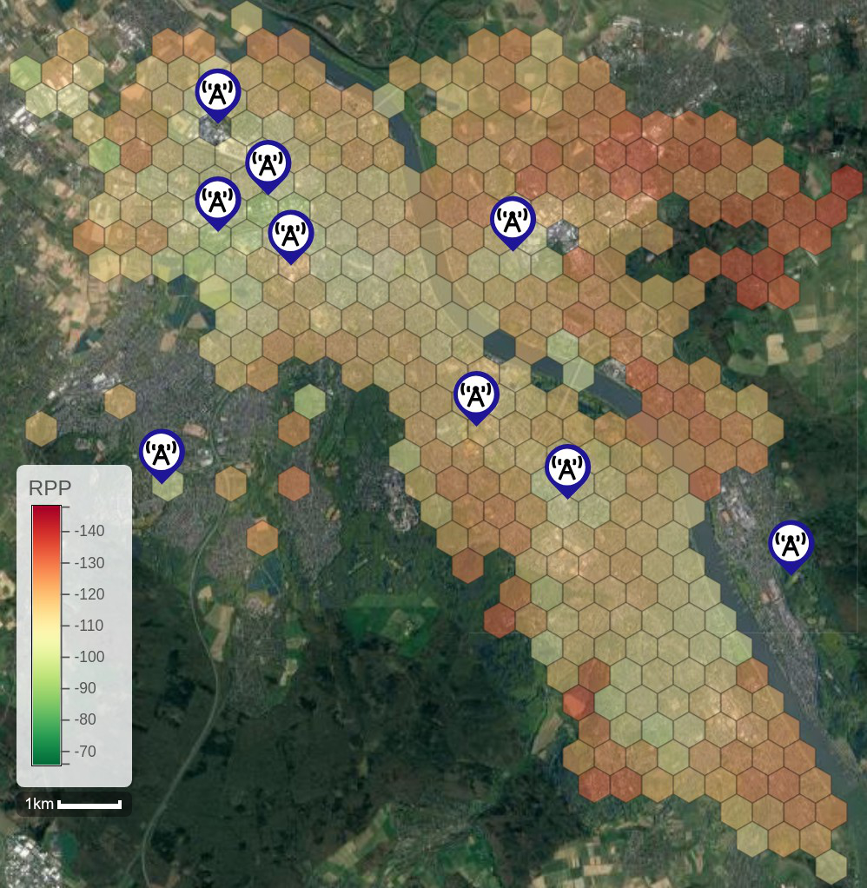

## Motivation
This repository contains all elements of a large-scale LoRa measurement study, performed by the ["Multimedia Communication Lab" (MCLab)](https://www.h-brs.de/en/inf/mclab/en) at the Hochschule Bonn-Rhein-Sieg, University of Applied Sciences in 2020/2021 in cooperation with Fraunhofer FKIE. It includes the schematics and the source code of our own developed LoRa based GPS sensor which were mounted on garbage trucks to measure the signal strength of several LoRa gateways located in the city of Bonn, Germany. A first evaluation and analysis of the data is provided as well as the raw measurement records. In doing so, we hope to stimulate further research on this topic.

 

## Citing this work

We encourage researchers working with this data and repository to cite [this](https://ieeexplore.ieee.org/document/9625531) VTC2021-Fall paper or directly use the following BibTeX entry. The author version of the paper can be found [here on arxiv](https://arxiv.org/abs/2109.07768).
 
 <details>
 <summary> <b>BibTeX entry for your research paper</b> </summary>
 
  ```bibtex
@INPROCEEDINGS{Rademacher2021,
  author={Rademacher, Michael and Linka, Hendrik and Horstmann, Thorsten and Henze, Martin},
  booktitle={2021 IEEE 94th Vehicular Technology Conference (VTC2021-Fall)}, 
  title={Path Loss in Urban LoRa Networks: A Large-Scale Measurement Study}, 
  year={2021},
  pages={1-6},
  doi={10.1109/VTC2021-Fall52928.2021.9625531}}
```
 </details> 

## Repository Organization
- [sensor](sensor) contains the schematics and the source code of our GPS sensor
- [rpp-gateway-verification](rpp-gateway-verification) contains our reference measurements to verify the reported RSSI/SNR values at the LoRa gateways
- [survey](survey) contains the raw measurement data as well as the path loss analysis
- [html](html) contains the implementation of a map to visualize the measurements

## Live Map
The measurements and the path loss analysis are visualized on a map which can be viewed [online](https://mclab-hbrs.github.io/lora-bonn/html/hexbinmap.html).


## Contact
If you want to perform your own analysis with our data, we would be happy to get in contact with you.  
E-Mail: [michael.rademacher@h-brs.de](mailto:michael.rademacher@h-brs.de)

## License
Our code of the LoRa based GPS sensor is licensed under [MIT License](https://opensource.org/licenses/MIT).  
The measurement data is licensed under the [Data license Germany – attribution – version 2.0](https://www.govdata.de/dl-de/by-2-0).