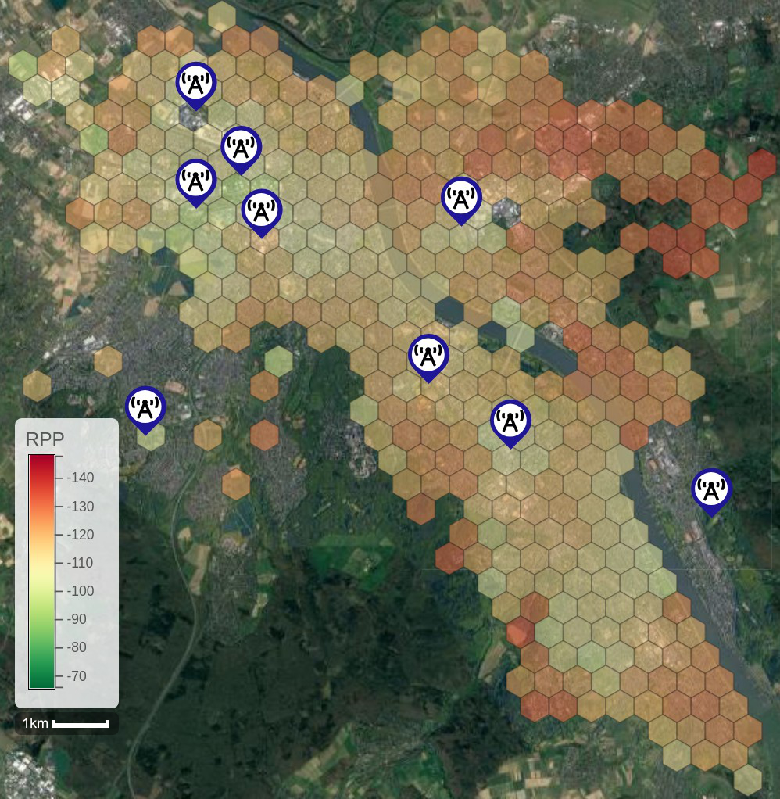

## Map
The measurements and the path loss analysis are visualized on a map based on [leaflet-d3](https://github.com/Asymmetrik/leaflet-d3) and can be viewed [online](https://mclab-hbrs.github.io/lora-bonn/html/hexbinmap.html).
