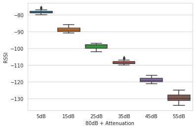
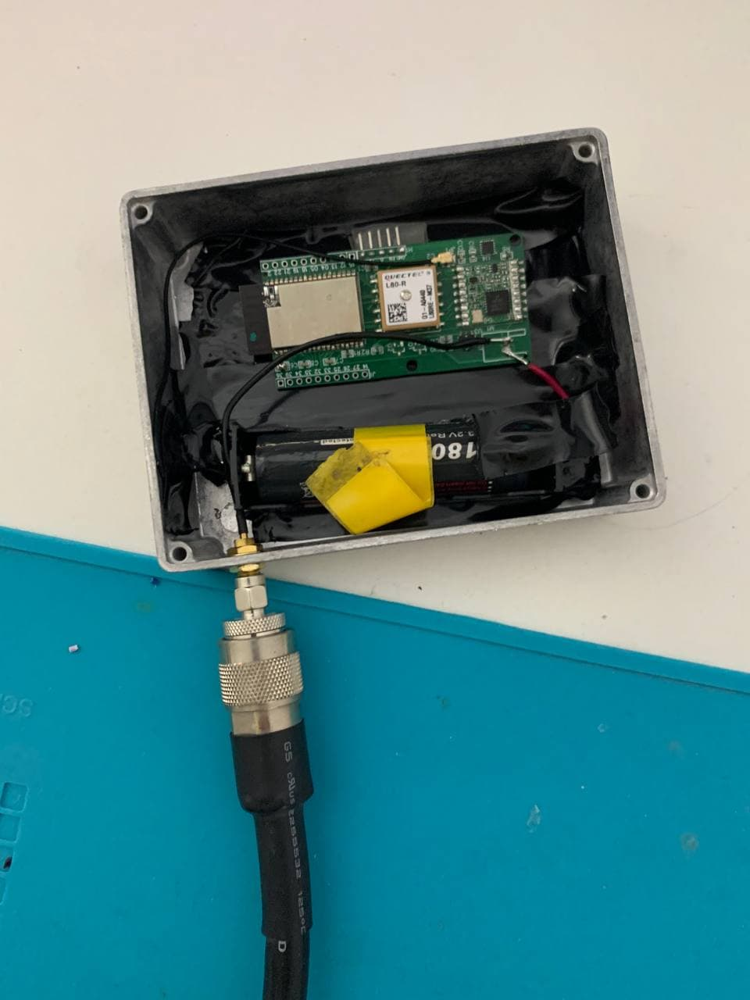
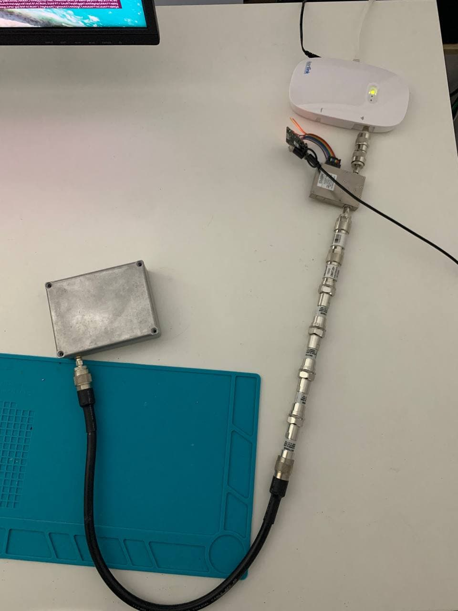

# Setup
**LoRaWAN End Node -> Attenuator -> Dynamic Attenuator -> LoRaWAN Gateway -> Zenner Plattform**

- The End Node must be tightly sealed in a shielded metal enclosure. The battery must be included in the enclosure. In order not to leave any gaps, the housing should be screwed tightly.

- For the test, the output power of 14dB was used. As attenuation 80dB + 5 to 55dB (dynamic) have resulted as reasonable values.

# Notes
- Each test was repeated 100 times. Check boxplots if more tests are necessary.
- Export packets from the Zenner Plattform via Webinterface. API not available.
- Python and Regex knowledge required.

# Result
 

# Pictures
 
 
